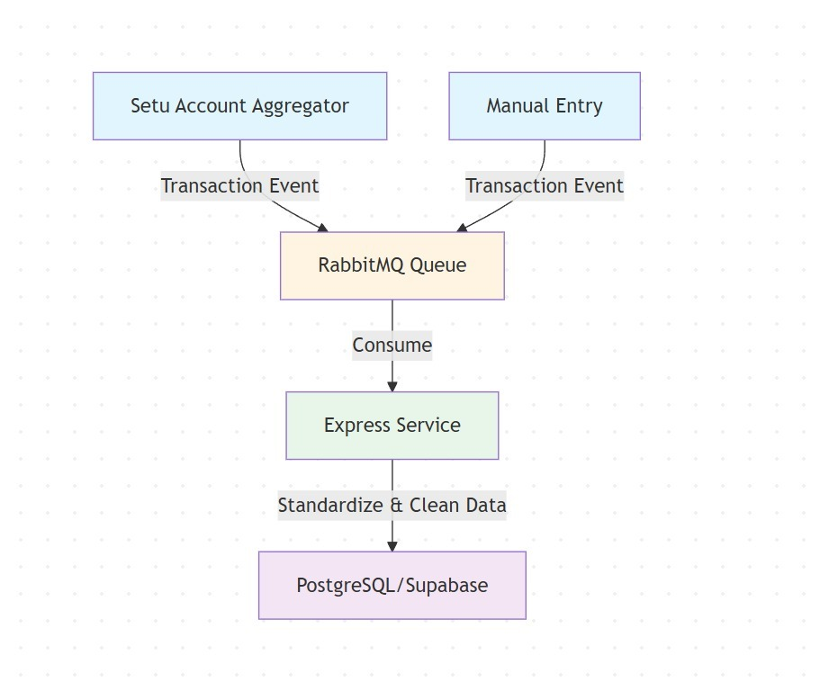
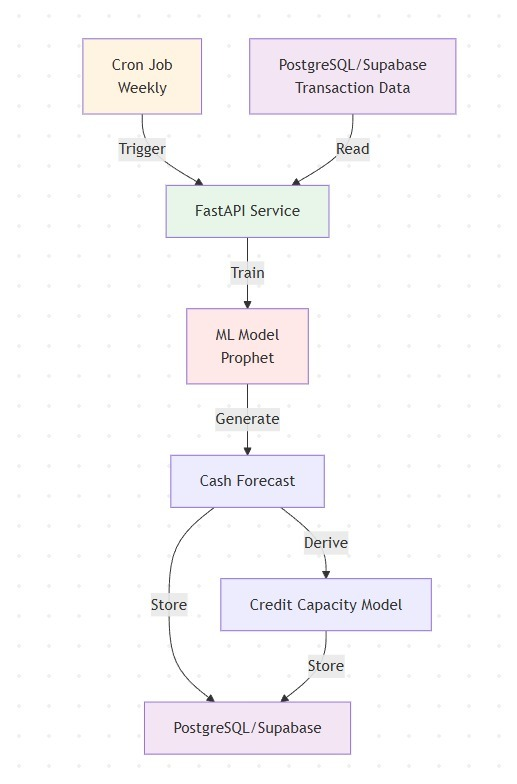
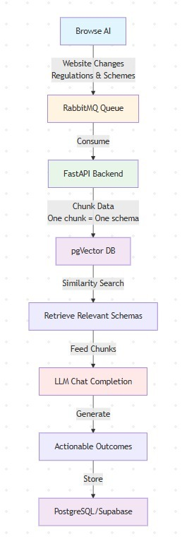
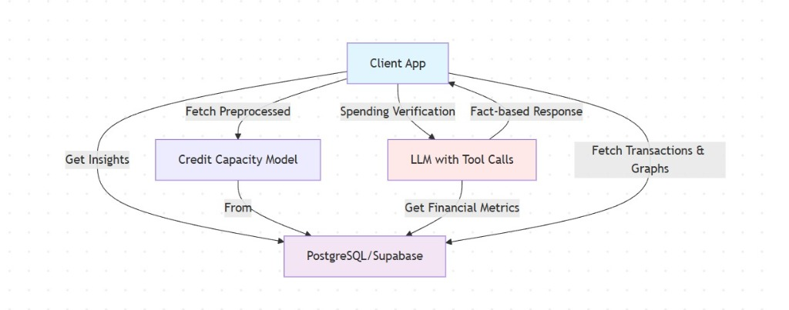

# 💰 FinAdvice

> An intelligent financial advisory platform that provides real-time cash flow forecasting, spending insights, and personalized government scheme recommendations for businesses.

## 🌟 Overview

FinAdvice is a comprehensive FinTech platform designed to help businesses make informed financial decisions through:
- **Automated Transaction Ingestion**: Seamless integration with Setu Account Aggregator for real-time financial data
- **ML-Powered Forecasting**: Prophet-based cash flow predictions and credit capacity modeling
- **AI-Driven Insights**: LLM-powered financial analysis and conversational insights
- **Smart Scheme Matching**: Vector-based similarity search to recommend relevant government schemes
- **Real-time Analytics**: Interactive dashboards with spending patterns and financial metrics

## 🏗️ Architecture

### Data Ingestion Pipeline


Transaction data flows through:
1. **Setu Account Aggregator** - Automated bank data fetching
2. **Manual Entry** - User-input transactions
3. **RabbitMQ Queue** - Asynchronous event processing
4. **Express Service** - Data standardization and cleaning
5. **PostgreSQL/Supabase** - Persistent storage

### ML Forecasting System


Weekly forecasting workflow:
1. **Cron Job** triggers weekly model training
2. **FastAPI Service** reads transaction data
3. **Prophet ML Model** generates cash flow predictions
4. **Credit Capacity Model** derives borrowing potential
5. **Results Storage** caches forecasts in PostgreSQL

### Scheme Recommendation Engine


AI-powered scheme discovery:
1. **Browse AI** scrapes government schemes and regulations
2. **RabbitMQ Queue** manages data processing
3. **FastAPI Backend** chunks and processes scheme data
4. **pgVector DB** stores embeddings for similarity search
5. **LLM Chat** generates actionable recommendations

### Client Interaction Layer


User-facing features:
1. **Credit Insights** - Preprocessed credit capacity data
2. **Spending Verification** - LLM-powered transaction analysis
3. **Fact-based Response** - Financial metrics and graphs
4. **Interactive Chat** - Conversational AI with tool calling capabilities

## 🚀 Tech Stack

### Frontend
- **React 19** with TypeScript
- **Vite** for fast development
- **TailwindCSS** for styling
- **React Query** for server state management
- **Recharts** for data visualization
- **React Router** for navigation

### Backend (Node.js)
- **Express** for REST API
- **TypeScript** for type safety
- **Supabase** for database and real-time features
- **Axios** for HTTP requests
- **Setu AA** for bank account aggregation

### ML Service (Python)
- **FastAPI** for high-performance async API
- **Prophet** for time series forecasting
- **scikit-learn** for ML models
- **Pandas & NumPy** for data processing
- **Google Gemini** for LLM-powered insights
- **pgVector** for semantic search

### Infrastructure
- **PostgreSQL/Supabase** for primary database
- **RabbitMQ** for message queuing
- **Docker** for containerization
- **Docker Compose** for orchestration

## 📁 Project Structure

```
finadvice/
├── client/              # React frontend application
│   ├── src/
│   │   ├── components/  # Reusable UI components
│   │   ├── pages/       # Route pages
│   │   ├── services/    # API clients
│   │   └── hooks/       # Custom React hooks
│   └── public/          # Static assets & architecture diagrams
│
├── server/              # Express.js backend service
│   ├── src/
│   │   ├── routes/      # API endpoints
│   │   ├── services/    # Business logic
│   │   └── config/      # Configuration files
│   ├── migrations/      # Database migrations
│   └── scripts/         # Utility scripts
│
├── ml/                  # Python ML service
│   ├── src/
│   │   ├── routes/      # FastAPI endpoints
│   │   ├── services/    # ML algorithms
│   │   │   ├── forecaster.py        # Prophet-based forecasting
│   │   │   ├── chat.py               # LLM integration
│   │   │   ├── metrics_calculator.py # Financial metrics
│   │   │   ├── recurring_detector.py # Pattern detection
│   │   │   └── snapshots.py          # Data snapshots
│   │   └── models.py    # Pydantic models
│   └── requirements.txt # Python dependencies
│
└── docker-compose.yml   # Multi-service orchestration
```

## 🛠️ Installation & Setup

### Prerequisites
- Node.js 18+ and npm/pnpm
- Python 3.10+
- Docker & Docker Compose
- Supabase account
- Setu Account Aggregator credentials (optional)
- Google Gemini API key

### Environment Setup

1. **Clone the repository**
```bash
git clone <repository-url>
cd finadvice
```

2. **Configure environment variables**

Copy `.env.example` to `.env` in each service directory and fill in the values:

```bash
# Root .env
SUPABASE_URL=your_supabase_url
SUPABASE_SERVICE_KEY=your_service_role_key
SETU_BASE_URL=https://fiu-uat.setu.co
SETU_CLIENT_ID=your_client_id
SETU_CLIENT_SECRET=your_client_secret
SETU_PRODUCT_INSTANCE_ID=your_product_instance_id
```

```bash
# ML Service .env
FINADVICE_GEMINI_KEY=your_gemini_api_key
FINADVICE_GEMINI_MODEL=gemini-2.0-flash-exp
CACHE_TTL_HOURS=168
FORECAST_MONTHS=3
```

3. **Database Setup**

Run migrations to set up the database schema:

```bash
cd server
npm install
npm run migrate  # Or manually run SQL files in migrations/
```

### Running with Docker (Recommended)

```bash
# Start all services
docker-compose up -d

# View logs
docker-compose logs -f

# Stop services
docker-compose down
```

Services will be available at:
- **Client**: http://localhost:5173
- **Server**: http://localhost:3001
- **ML Service**: http://localhost:8000

### Running Locally (Development)

**Terminal 1 - Server**
```bash
cd server
npm install
npm run dev
```

**Terminal 2 - ML Service**
```bash
cd ml
pip install -r requirements.txt
uvicorn src.main:app --reload --port 8000
```

**Terminal 3 - Client**
```bash
cd client
npm install
npm run dev
```

## 📊 Key Features

### 1. **Cash Flow Forecasting**
- Prophet-based time series prediction
- 3-month forward-looking forecasts
- Confidence intervals and trend analysis
- Weekly automatic retraining

### 2. **Credit Capacity Analysis**
- ML-driven borrowing potential calculation
- Risk assessment based on transaction patterns
- Historical performance tracking

### 3. **Spending Analytics**
- Categorized transaction insights
- Recurring payment detection
- Expense trend visualization
- Month-over-month comparisons

### 4. **Government Scheme Recommendations**
- Semantic search using pgVector
- Business-category specific matching
- LLM-generated actionable recommendations
- Coverage for food, healthcare, and more sectors

### 5. **Conversational AI Assistant**
- Natural language financial queries
- Tool-calling capabilities for data retrieval
- Context-aware responses
- Transaction verification and analysis

## 🔒 Security & Compliance

- **Supabase RLS**: Row-level security for multi-tenant data isolation
- **Environment Variables**: Sensitive credentials stored securely
- **CORS Configuration**: Controlled cross-origin access
- **Data Privacy**: Local processing, minimal third-party exposure

## 🧪 API Endpoints

### Server (Express)
- `GET /api/transactions/:userId` - Fetch user transactions
- `POST /api/transactions` - Create new transaction
- `GET /api/setu/accounts` - Get linked bank accounts
- `POST /api/setu/consent` - Request account aggregation consent

### ML Service (FastAPI)
- `GET /api/ml/metrics/:userId` - Calculate financial metrics
- `GET /api/ml/forecast/:userId` - Get cash flow forecast
- `GET /api/ml/recurring/:userId` - Detect recurring transactions
- `POST /api/ml/chat/:userId` - Conversational AI chat
- `GET /health` - Service health check

## 📈 Performance Optimizations

- **Caching**: 168-hour TTL for ML predictions
- **Async Processing**: RabbitMQ for background jobs
- **Database Indexing**: Optimized queries for transactions
- **Vector Search**: Efficient similarity matching with pgVector
- **Model Persistence**: Cached ML models to reduce training time

## 🛣️ Roadmap

- [ ] Multi-currency support
- [ ] Advanced fraud detection
- [ ] Invoice management integration
- [ ] Mobile app (React Native)
- [ ] Webhook notifications
- [ ] Advanced budgeting tools
- [ ] Tax optimization suggestions

## 👥 Contributing

Contributions are welcome! Please follow these steps:

1. Fork the repository
2. Create a feature branch (`git checkout -b feature/amazing-feature`)
3. Commit your changes (`git commit -m 'Add amazing feature'`)
4. Push to the branch (`git push origin feature/amazing-feature`)
5. Open a Pull Request

## 📄 License

This project is licensed under the MIT License - see the LICENSE file for details.

## 🙏 Acknowledgments

- **Setu** for Account Aggregator infrastructure
- **Facebook Prophet** for time series forecasting
- **Supabase** for database and authentication
- **Google Gemini** for LLM capabilities
- **pgVector** for vector similarity search

---

**Built with ❤️ for smarter financial decision-making**
